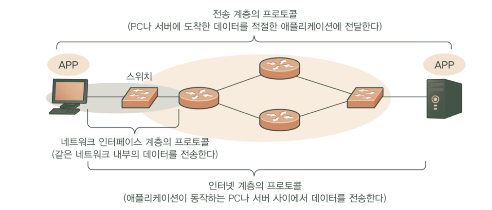

## LAN
- 좁은 범위의 네트워크
- LAN의 범위는 지리적 면적 보다도 '네트워크의 구축과 관리를 누가 담당하는가?'로 구분
- LAN의 특칭
  - 사용자가 직접 구축, 관리
  - 통신요금이 필요 없다 (내부의 통신에서, 외부에선 필요)

## 인터넷이란?
- 전 세계의 ISP가 계층구조로 연결된 네트워크

## WAN
- 기업의 거점 사이를 연결하는 네트워크 
- 서로 떨어진 기업 거점의 LAN을 상호 연결 하기 위한 네트워크

## 인터넷과 WAN의 차이
- 네트워크 관리자
  - WAN은 전기통신사업자가 모두 관리
  - 인터넷은 접속사업자인 ISP들이 각각 분담에서 관리하고, 관리범위도 자신들의 네트워크에 한정되어있음
- 통신상태
  - WAN은 사내의 컴퓨터에 한정, 즉 사내 네트워크의 일부 
  - 인터넷은 누구든지 접속 가능, 즉, 외부 네트워크

## 프로토콜과 네트워크 아키텍처

### 데이터를 송수신하는 것은?
- 프로토콜
  - 통신 규약
  - 프로토콜 규약
    - 데이터의 포맷
    - 데이터를 송수신하는 순서
    - 데이터의 송신처
    - 에러처리
  - 기기들은 같은 통신 프로토콜(규약)에 기초하여 네트워크 통신을 수행
    단, 하나 통신 프로토콜 사용 X -> 그럴경우, 복잡해지고, 기능추가등 확장성 부족해지므로 기능마다 복수의 통신 프로토콜이 정의 되어 있음
  - 즉 네트워크  통신은 복수의 프로토콜 조합으로 구현되어 있음
- 네트워크 아키텍처
  - 프로토콜 조합
  - 통신 아키텍처나 프로토콜 스택이라고도 불림
  - 통신에 필요한 기능들을 모듈화해 계층 구조로 만든위, 각 계층(모듈)의 기능을 구현하기 위한 통신 프로토콜의 조합

### OSI 참조 모델
- 국제표준화기구 ISO에서 제정
- 네트워크의 7가지 계층
  - 응용 계층 (최상층)
  - 표현 계층
  - 세션 계층
  - 전송 계층
  - 네트워크 계층
  - 데이터링크 계층
  - 물리 계층(최하층)

### TCP/IP 란?
- OSI 대신 요즘 사용하고 있는 네트워크 아키텍처
- 네트워크 인터페이스 계층에 대해 규정 X -> 통신시 WAN, LAN 자유롭게 구현 가능
- 즉 네트워크 구성에 의존하지 않고, 어떠한 WAN, LAN 이더라도 통신가능

## 데이터 명칭
| 데이터의 명칭 | 통신 프로토콜의 계층     | 주요 예시                     |
|---------|-----------------|---------------------------|
| 메시지     | 주로 표현 계층        | HTTP 메시지                  |
| 세그먼트    | 주로 전송 계층        | TCP 세그먼트                  |
| 데이터그램   | 주로 전송, 네트워크 계층  | UDP 데이터 그램   IP 데이터그램 |
| 패킷      | 주로 네트워크 계층      | IP 패킷                     |
| 프레임     | 주로 데이터링크 계층     | 이더넷 프레임                   |
| PTR     | IP주소에 해당하는 호스트명 | PTR                       |
- 기준일뿐 엄밀히 구분해서 사용하는 것은 아님

### TCP/IP의 4개 계층의 역할
- 애플리케이션끼리 데이터를 주고받을 수 있게 하기 위해 저마다 역할을 분담하고 있음
- 응용 계층 - 애플리케이션끼리 데이터를 주고받기 위한 규약, 즉 데이터 포맷이나 데이터의 송수신 순서 등을 규정
- 응용 계층의 하위 프로토콜(전송, 인터넷, 네트워크 인터페이스 계층)은 애플리케이션 사이의 통신 데이터를 전송하는 것이 주된 역할

### 계층별 통신 경로
- 네트워크는 라우터에 의해 상호 연결, PC나 서버 등을 네트워크에 연결하기 위해서는 스위치 이용
- 라우터에 의해 구분되는 범위가 '하나의 네트워크'
- 네트워크 인터페이스 계층 - PC와 웹 서버 사이에서 같은 네트워크 내부의 데이터 전송에 이용
- 인터넷 계층 - 애플리케이션을 실행하고 있는 컴퓨터끼리의 데이터 전송
- 전송 계층 - 목적 애플리케이션에 데이터를 전송하기 위해 이용

### 하위 계층의 통신 경로가 기반이 된다
- 상위 계층의 전송 프로토콜이 하위 계층의 전송 프로토콜을 기반으로 하고 있기 때문에
어떠한 계층이 제 기능을 하지 못한다면 그 상위 계층들도 제기능을 할수 없다.
- 즉, 어떠한 장애가 발생하면 원인은 네트워크 인터페이스 계층 부터 조사해야함!
